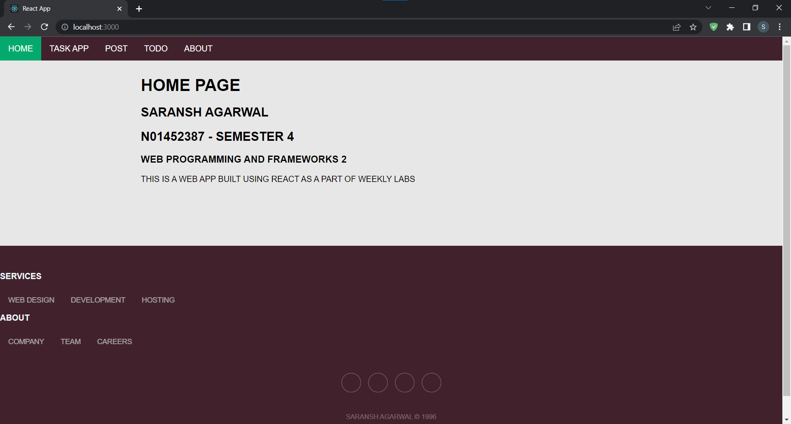
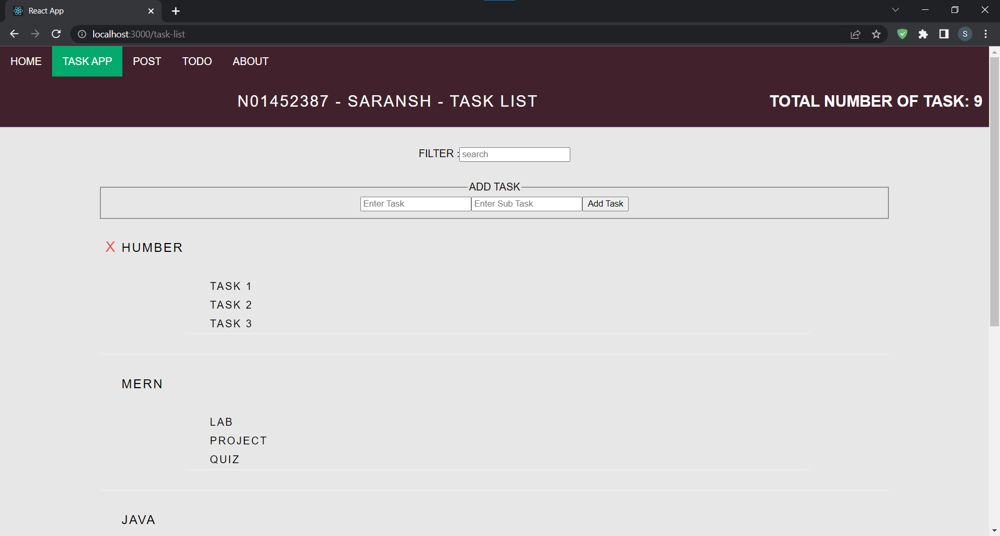
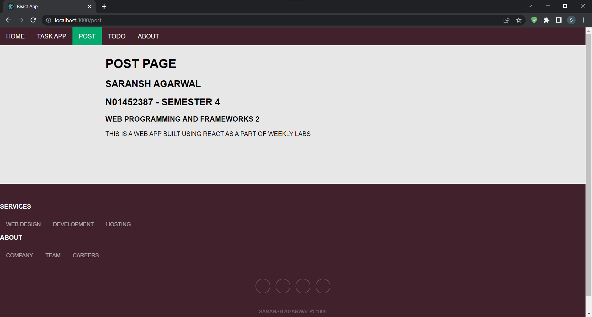
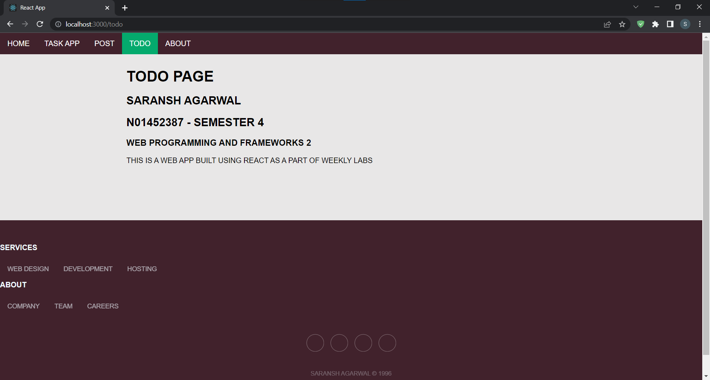
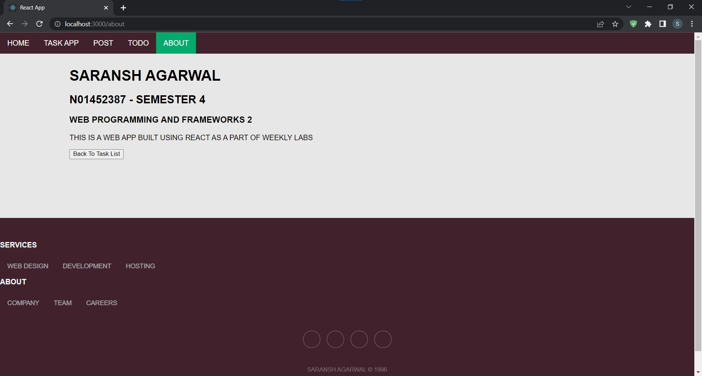

# lab-4-saransh808

## Tasks
> Add Context API to the TaskApp from Lab 3

>Add Navigation to Lab 4 (Home, Task List, Post, Todo, About)

>Style your components

## Learning Curve
> The lab was completed.

> Added all the pages to create a app based on components.

> Used context API to make 1 page web app.

> Used routes to link pages into the compnents.

## Resource

> W3CSchool.com

> Things tough by Nithya Thayananthan(Professor) plus content from Week 3 class as reference.

## Home

## Task App

## POST

## TODO

## About

